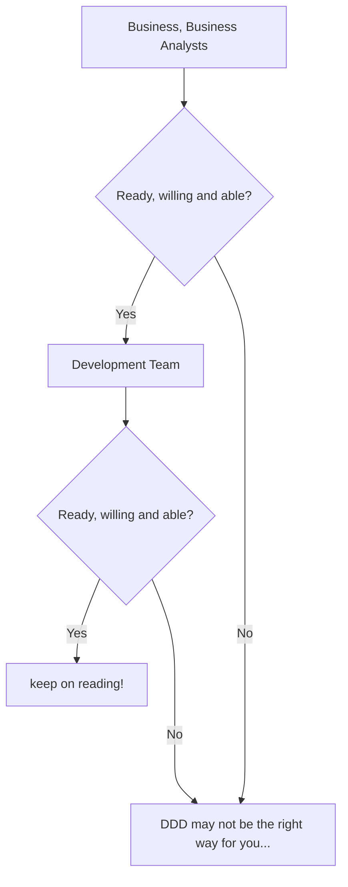
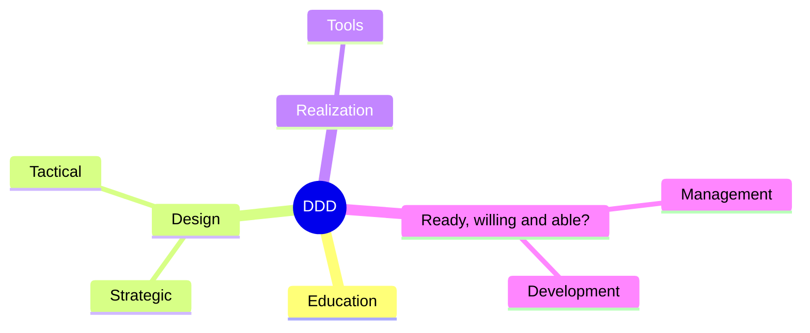
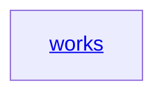

## DDD: before you start...
...you plan to use Domain Driven Design in your company?


# DDD
Domain Driven Design


<details>
  <summary>DDD links</summary>
  <details>
    <summary>Design</summary>
      <a href='https://github.com/ddd-crew/ddd-starter-modelling-process'>a good starting point...</a>
  </details>
  <details>
    <summary>Education</summary>
      <details>
      <summary>DDD patterns (Context Mapper)</summary>
      <a href='https://contextmapper.org/docs/language-reference/'>patterns overview</a>
        <br />
        <a href='https://contextmapper.org/docs/language-model/'>domain model</a>
      </details>
      <a href='https://www.domainlanguage.com/ddd/'>"The Blue Book" Domain-Driven Design (Eric Evans)</a>
      <br />
      <a href='https://vaughnvernon.com'>Vaughn Vernon (author of Implementing Domain-Driven Design)</a>
      <br />
      <a href='https://github.com/ddd-crew'>DDD Crew</a>
  </details>
  <details>
    <summary>Tools</summary>
      <a href='https://contextmapper.org/docs/home/'>Context Mapper: a Modeling Framework for Strategic Domain-driven Design</a>
      <br />
      <a href='https://docs.vlingo.io'>DDD Design Tool</a>
  </details>
</details>



```stl
solid cube_corner
  facet normal 0.0 -1.0 0.0
    outer loop
      vertex 0.0 0.0 0.0
      vertex 1.0 0.0 0.0
      vertex 0.0 0.0 1.0
    endloop
  endfacet
  facet normal 0.0 0.0 -1.0
    outer loop
      vertex 0.0 0.0 0.0
      vertex 0.0 1.0 0.0
      vertex 1.0 0.0 0.0
    endloop
  endfacet
  facet normal -1.0 0.0 0.0
    outer loop
      vertex 0.0 0.0 0.0
      vertex 0.0 0.0 1.0
      vertex 0.0 1.0 0.0
    endloop
  endfacet
  facet normal 0.577 0.577 0.577
    outer loop
      vertex 1.0 0.0 0.0
      vertex 0.0 1.0 0.0
      vertex 0.0 0.0 1.0
    endloop
  endfacet
endsolid
```

```geojson
{
  "type": "FeatureCollection",
  "features": [
    {
      "type": "Feature",
      "id": 1,
      "properties": {
        "ID": 0
      },
      "geometry": {
        "type": "Polygon",
        "coordinates": [
          [
              [-90,35],
              [-90,30],
              [-85,30],
              [-85,35],
              [-90,35]
          ]
        ]
      }
    }
  ]
}
```
