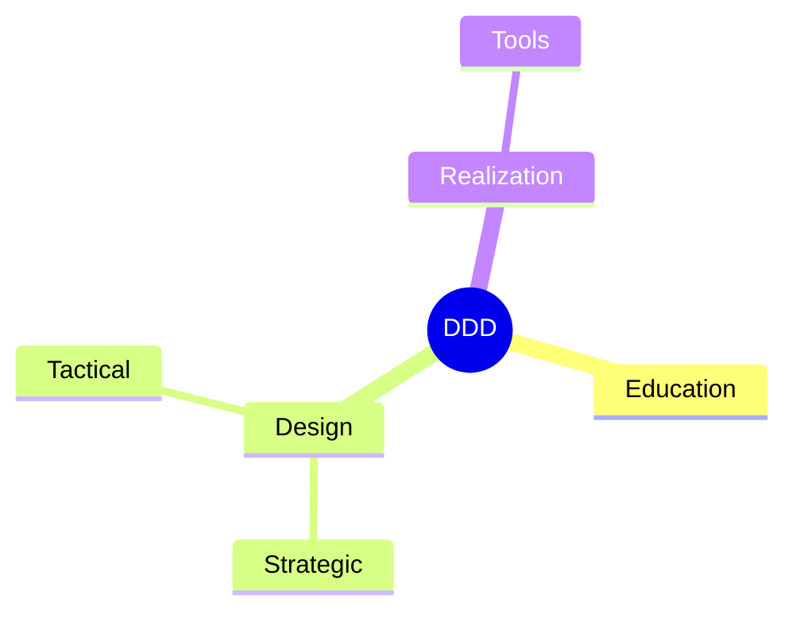

<dl>
    <dt>Is  <a href='https://verraes.net/2021/09/what-is-domain-driven-design-ddd/'>DDD</a> the right thing for your company?</dt>
      <dd>
        <ul>
          <li>:speech_balloon: chapter 1 of <a href='https://kalele.io/books/'>Implementing Domain-Driven Design</a> may help to find an answer</li>
        </ul>
      </dd>
</dl>

# DDD: Domain Driven Design

  
DDD links

  

    
Design

      <a href='https://github.com/ddd-crew/ddd-starter-modelling-process'>a good starting point...</a>
  

  

    
Education

      

      
DDD patterns (Context Mapper)

      <a href='https://contextmapper.org/docs/language-reference/'>patterns overview</a>
         
        <a href='https://contextmapper.org/docs/language-model/'>domain model</a>
      

      <a href='https://www.domainlanguage.com/ddd/'>"The Blue Book" Domain-Driven Design (Eric Evans)</a>
       
      <a href='https://vaughnvernon.com'>Vaughn Vernon (author of Implementing Domain-Driven Design, great book IMHO)</a>
       
      <a href='https://github.com/ddd-crew'>DDD Crew</a>
  

  

    
Realization

      <a href='https://contextmapper.org/docs/home/'>Context Mapper: a Modeling Framework for Strategic Domain-driven Design</a>
       
      <a href='https://docs.vlingo.io'>DDD Design Tool</a>
  

