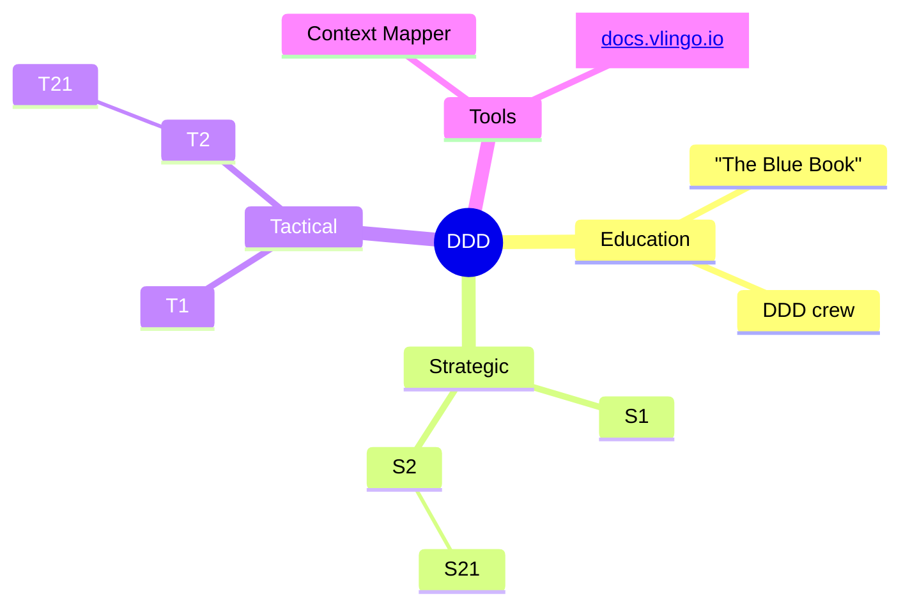
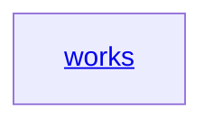

# ddd
Domain Driven Design

```mermaid
mindmap
  root((DDD))
    Education
      "The Blue Book"
      DDD crew
    Strategic
      S1
      S2
        S21
    Tactical
      T1
      T2
        T21
    Tools
      Context Mapper
      A[<a href='https://google.com'>docs.vlingo.io</a>]
```

```mermaid
flowchart TB
  A[<a href='https://google.com'>works</a>]
```
